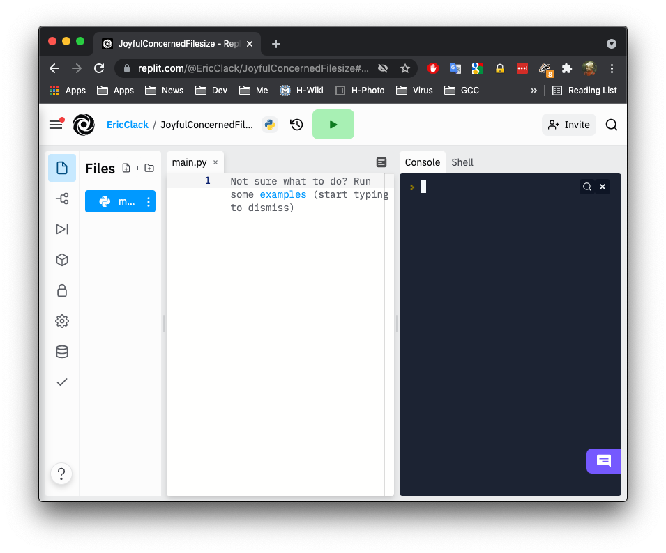

.. Python Text Adventure Tutorial documentation master file, created by
   sphinx-quickstart on Sat Oct  2 10:14:05 2021.
   You can adapt this file completely to your liking, but it should at least
   contain the root `toctree` directive.

Welcome to Python Text Adventure Tutorial!
==========================================

In this tutorial we'll use Python to create a text adventure. You'll get to create a world of your own for players to explore, and get to know the Python language, learning about functions, if-statements and data structures. 

We're going to use the free, online `Replit`_ site to create your text adventure, which means you've nothing to install to get started. If you have Python installed you can of course use that. 

Register with Replit
--------------------

Head over to the `Replit`_ site and click the `Sign up` button at the top right of the screen. Choose a username (which will be public so don't use your real name unless you are an adult), pop your email address in and choose a password.

Once you've created an account, log in and you'll see the dashboard. You can create a new Repl by clicking the link at the top left: `+ Create Repl` -- do this now.

You'll be asked to choose a template, make sure you choose `Python`, then give your program a title and finally click `+ Create Repl`.

Now let's just do a simple test to see that everything is working.

You'll see two sides to your browser screen:

- On the left you have your program, with the filename `main.py` at the top, where you write code to run later
- On the right you have a Console, where you can run Python code straight away.

Let's try both...

On the right, in the console, type the following:

.. code:: python

   print("Hello world! " * 100)

You'll see when you press return the code runs right away.

On the left, in your `main.py` file, type the following:

.. code:: python

   for a in range(10):
     print("Hello! " * a)

You'll see that nothing happens after typing in this code. That's because you need to press the green `Run` button -- go ahead and do it and see what happens.

You might get an error, if so, check what you typed in with what's above and try again. 
     

Start the Tutorial
------------------

Now we're ready to start, click on the Part 1 link below...

.. toctree::
   :maxdepth: 2
   :caption: Contents:

   part1
   part2
   part3

Get in touch
------------

We would love to hear how you've got on with this tutorial or receive
any other feedback. Get in touch with the author: |author|
 
   

Indices and tables
==================

* :ref:`genindex`
* :ref:`modindex`
* :ref:`search`

.. _replit: https://replit.com/  

----

(c) Copyright 2021, Eric Clack

Licensed under the Creative Commons Attribution-NonCommercial-ShareAlike v4.0
