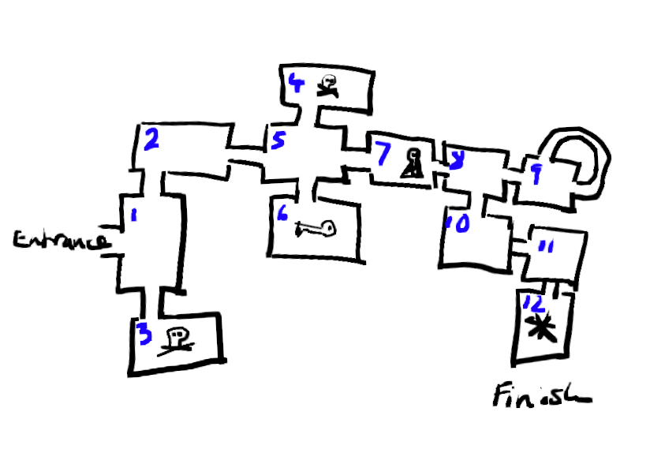

.. _part2:

Part 2
======

In part 2 we're going to add several more rooms, and allow the user to move in more directions. 

First let's draw a map of our world
-----------------------------------

We need to do some planning now so that our world makes sense and we can see the various paths that our player can take. So take a piece of paper and draw a map. Here's an example...

You can see various items: a skull and crossbones, a key and a keyhole. 
		   

Left / Right or East / West?
----------------------------

You'll notice a problem when you look at your map: if we ask the player whether to go left or right, this is relative to which way they've come from.

Example: if you are standing in room 1 having come from the entrance then left would lead you to room 2, and right to room 3; however if you were coming from room 2, you could go straight ahead or turn right to exit the world.

How do we fix this? By using North, South, East, West. 

So let's update our `which_direction` function. But wait, looking at the map the directions will depend upon where we are, so we need to be able to tell the function which directions are possible each time we call it.

Here's what we need to change: 

.. code-block:: python
   :emphasize-lines: 1,4,5,8
      
   def which_direction(choices):

     while True:
       c = ", ".join(choices)
       go = input("Which way do you want to go: " + c + "? ")
       if go == "": continue
       go = go[0].lower()
       if go in choices:
	 return go
       else:
	 print("I don't understand")

So what did we change?

1. The function now takes a single `argument` called `choices`. This is a list of possible directions that the player can choose from.
2. We turn that list into a comma-separated string
3. We present this to the player and ask them to make their choice
4. We check what they type in matches one of the choices with :code:`if go in choices`

If you run your program now you'll get an error like this: 

.. code::

   TypeError: which_direction() missing 1 required positional argument: 'choices'

That's because you've been using `which_direction` without any arguments, because we didn't need them before -- it always asked the player: Left or Right?

So go back into your code and change where you've used this function and add in some items from the list `['n', 's', 'e', 'w']`, not forgetting the square brackets. 

Here's an example from part 1:

.. code-block:: python
   :emphasize-lines: 31

   def which_direction(choices):

     while True:
       c = ", ".join(choices)
       go = input("Which way do you want to go: " + c + "? ")
       if go == "": continue
       go = go[0].lower()
       if go in choices:
	 return go
       else:
	 print("I don't understand")

   def room2():
     print()
     print("You are in the left tunnel, it is quite dark")
     print("You see a hole on the left leading to a space below, and to the right you can see a way to climb up into another tunnel.")

   def room3():
     print()
     print("You are in the right tunnel, it is a dead end.")

   player = input("What's your name explorer? ")	  
   print("Welcome to the caves of Xandos,", player)

   print()
   print("You are standing in the entrance to a huge cave network.")
   print("You can see a torch on the ground, and can see two tunnels")
   print("One heading East, one heading West.")

   go = which_direction(['e', 'w'])

   if go == 'e':
     room2()
   if go == 'w':
     room3()

Build the world
---------------

Now we have a lot of what we need to add our different rooms or locations to the game.

For each location you need to create a function that looks like this:

.. code:: python

   def room_name():

     print()
     print("Your description of the room")
     print("Your explanation of which way the player can go")

     # Edit the list of letters depending on what's possible: 
     go = which_direction(['n', "s', 'e', 'w'])

     if go == 'n':
       name_of_room()
     if go == 's':
       name_of_room()
     #etc

This is where it helps to be organised and draw a good map with labels for each room, so you can find the code that corresponds to each one.

Every room is a function
------------------------

If you look carefully at the code at the end of your program you'll notice that the welcome messages and entrance descriptions are not inside any function, they don't have any spaces at the start of their lines.

This means it won't be possible to move back into the entrance when playing the game. It is also a bit untidy and inconsistent, and all good programmers like things to be tidy and consistent!

So let's fix it. There are two things going on at the end of your code:

 1. The welcome message
 2. The entrance room

So let's create two functions like so -- replace the code with the following: 

.. code:: python

   def welcome():
     player = input("What's your name explorer? ")	  
     print("Welcome to the caves of Xandos,", player)   

   def entrance():
     print()
     print("You are standing in the entrance to a huge cave network.")
     print("You can see a torch on the ground, and can see two tunnels")
     print("One heading East, one heading West.")

     go = which_direction(['e', 'w'])

     if go == 'e':
       room2()
     if go == 'w':
       room3()   

And don't forget to call these two functions, add these two lines right at the end of your program:

.. code:: python

   welcome()
   entrance()
	  

Next up
-------

In the next part we'll add code so that the player can pick things up and use them. Read on to :ref:`Part3`.

